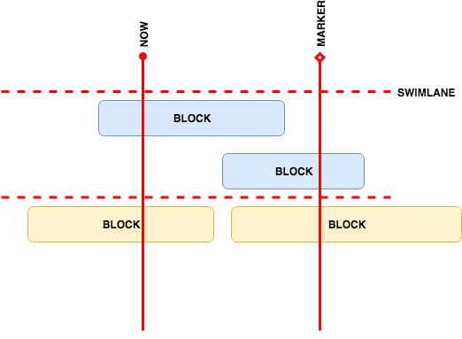

# Ganttilla

Effortless roadmap visualisation tool. Visit [the demo page](https://youthful-leakey-912679.netlify.com/chart/empire) here to verify how it works.

## How it works

The Ganttilla draws roadmap based on the `JSON` descriptor files in the assets directory. 

### Diagram of concepts
   


### Descriptor file

The description file should contain list of objects, each one representing block of work.
Take for example the [src/assets/empire.json](https://github.com/ocadotechnology/ganttilla/blob/master/src/assets/empire.json).

Fields `start_date` and `end_date` should store dates in yyyy-MM-dd pattern. The `swimlane` field is optional.

```json
[
  {
    "title": "Destroy the Death Star", 
    "description": "Blow up that thing", 
    "start_date": "2018-12-10",
    "end_date": "2019-03-09", 
    "link": "https://github.com/ocadotechnology/ganttilla", 
    "swimlane": "Freedom" 
  }
]
```
   
## Getting help

Having trouble with Ganttilla? We'd like to help!

* Ask a question - we monitor [ganttilla/issues](https://github.com/ocadotechnology/ganttilla/issues)
  for questions.
* Report bugs with Ganttilla at [ganttilla/issues](https://github.com/ocadotechnology/ganttilla/issues).


## Reporting Issues

Ganttilla uses GitHub's integrated issue tracking system to record bugs and feature
requests. If you want to raise an issue, please follow the recommendations below:

* Before you log a bug, please [search the issue tracker](https://github.com/ocadotechnology/ganttilla/issues)
  to see if someone has already reported the problem.
* If the issue doesn't already exist, [create a new issue](https://github.com/ocadotechnology/ganttilla/issues/new).
* Please provide as much information as possible with the issue report, we like to know
  the version of Ganttilla that you are using.
* If you need to paste code use Markdown **```** escapes
  before and after your text.
* If possible try to create a test-case or project that replicates the issue.


## Building from Source

You need `npm` installed on your computer. 

To start the project locally run:

----
	$ npm install
	$ npm start
----


To build the project run:

----
	$ npm install
	$ npm run-script build
----

## License

Ganttilla is Open Source software released under the
[Apache 2.0 license](http://www.apache.org/licenses/LICENSE-2.0.html).